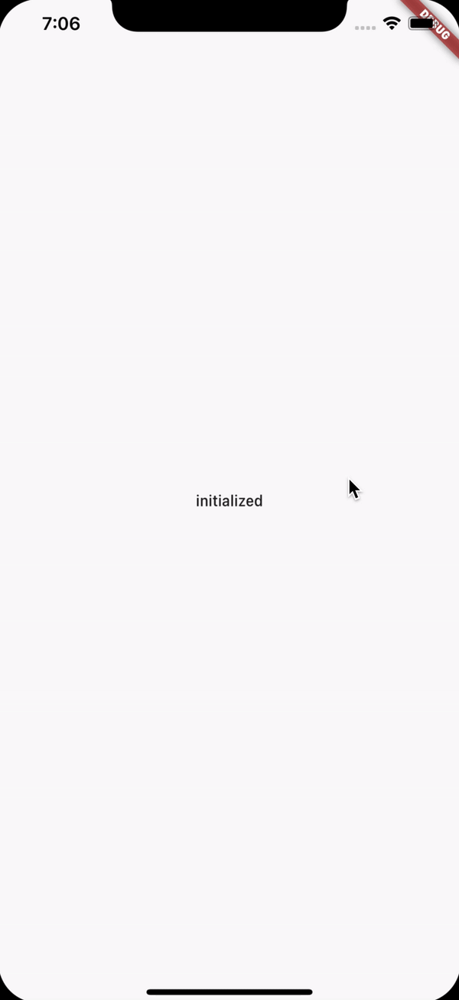

<h1 align="center">completer_dialog</h1>

    The Project to Learn about Completer & Dialog Service

## Features

1. DialogService is not from stacked_services package. It is simply implemented by the rflutter_alert package.

2. Originally, UI just can use the DialogService. To separate the UI that is using DialogService from other UIs, DialogManager that listens the instructions from DialogService is inevitable.

3. DialogManager builds the child Widget of UI. The Dialog UI is implemented in it by a method to register in the DialogService. This method is set in the DialogService on the initState of the lifecylce of the DialogManager. The actions from the button interaction to return Response of Dialog is set on the method by using Completer.

4. Not to make the DialogManager generated serveral time on the scaffold (like navigating through pushReplacement), this is implemented on the builder of MaterialApp. It requires the Navigator Widget to use Dialog, so DialogManager is wrapped with Navigator due to the original Navigator Widget is under the builder of MaterialApp. (The reason why DialogManager above the MaterialApp is not used is to maintain the MaterialApp as a root except Providers.)

5. In summary, the Business Logic of a Dialog is in the DialogService. Also, DialogManger links the UI and the Business Logic in the DialogService. (Makes the separation of both sucessfully.)

## Demo

    

