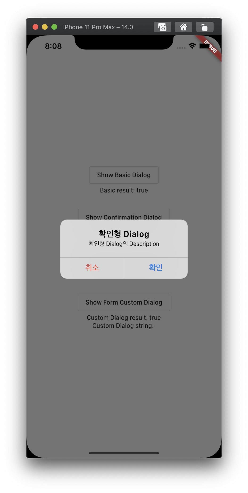
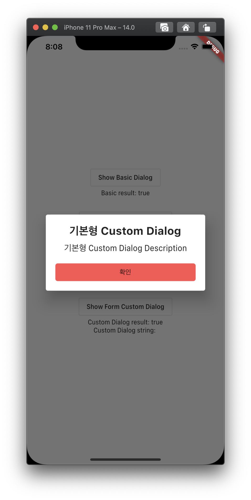
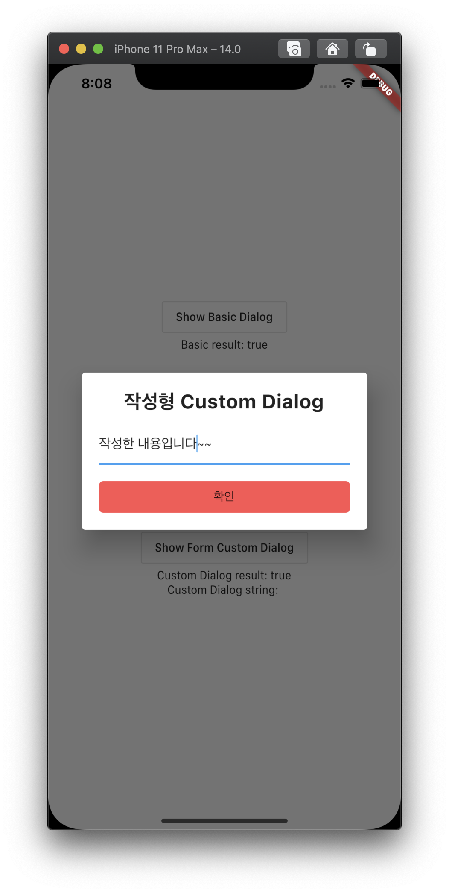

# custom_dialog

Testing for Making Custom Dialog without Context of Widget

## Package Preparation

1. get
   Maintain Services like Dialog, SnackBar, Navigating as a singleton

2. injectable & injectable_generator
   Easily register the services above to GetIt instance with automatically generated script

3. build_runner
   The library that generates script of injectable things of No.2

4. stacked_services
   To customize dialog provided by the package (also navigating, snackbar)

5. stacked
   To check the state of the result after using dialog without setState

6. flutter_hooks
   To use TextEditingController widget without using StatefulWidget

## How to Generate locator.config.dart

1. Download the packages above

2. Create locator.dart into services folder
   (and write the code)

3. Create third_party_services_module.dart into services folder
   (and write the code)

4. Type "flutter pub run build_runner build --delete-conflicting-outputs"

5. When locator.config.dart created, re-import the script on locator.dart

## Demo

    
    
    
    

