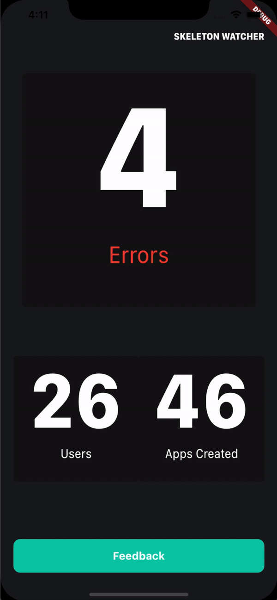

<h1 align="center">scoped_model_practice</h1>

    The Project to Learn State Management by Scoped Model

## What is this project?

This application is a Real-Time Feedback by using Cloud Firestore as a Stream Data. On the main page, it fetches the count of the information. Also, when a user send a feedback, the feedback is added to the FeedBackView. When a feedback is read, the notification mark on it is disappeared.

## Features

1. The purpose of this project is to learn about ScopedModel to manage state. ScopedModel is similar to the Provider, but has more shortage than the Provider. We would like to know that by implementing ScopedModel.

2. This project is using Cloud Firestore of Firebase.

3. To separate the status of handling data, ViewState has been implemented as enumeration. Each of ScopedModel (HomeViewModel, FeedbackViewModel) is listening the fetched data from Cloud Firestore and send the data to the connected event listener to handle the ViewState.

4. Views like HomeView, FeedbackView are processing their UI from the ViewState of each ScopedModel.

5. Before calling the constructor of ScopedModel, there is a declare statement of firebase service which is maintained in the locator of GetIt instance. When the firebase service is constructed, its instance is initialized by firebase_core Package and fetch data on the Cloud Firestore. Fetched data is passed as a stream, and that stream is added to the sink from the constructor on the firebase service.

6. All of the ScopedModel are extending the BaseModel. BaseModel has ViewState to control the data handling status. This extension helps to reduce many codes.

7. ScopedModel is the such a representative MVVM Pattern, so each View is using ScopedModel as a ViewModel. Also, like the BaseModel, all of the Views are extending BaseView. BaseView includes the ScopedModel Widget that has the ScopedModelDescendant which can call the builder of the rest of UIs on the View. BaseView is implemented to have Template arugments because that has to accomodate universal ScopedModel.

8. On the locator.dart, FirebaseService is maintained as a singleton and registered by LazySingleton in the GetIt instance. Also, HomeViewModel is registered as a Factory in the GetIt instance. That does not affect the application because HomeViewModel is only created once in the lifecycle. Surprisingly, FeedbackViewModel is registered as a Singleton, though HomeViewModel is not. That is related to the StreamController in the FirebaseService. Both HomeViewModel and FeedbackViewModel are using the StreamController in the FirebaseService, the FeedbackViewModel is created serveral times due to the builder of the MaterialPageRoute when navigation happens.

## Demo

    

