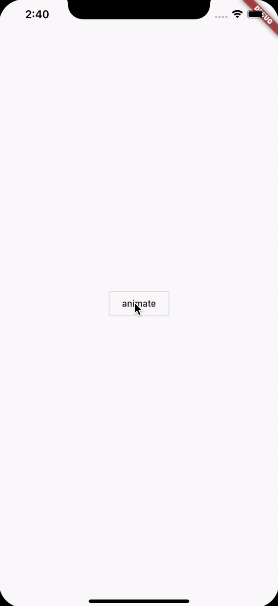

<h1 align="center">sequence_animation</h1>

    The Project to Learn Basic Animation and Sequence Animation by "flutter_sequence_animation" Package

## 3 Factors for Animation in Flutter

1. AnimationController

    This object controls the Animation to producing a new value for rendering a frame. (like forward or reverse)

    It is tracking the state of the Animation.

2. Animation / Tween

    Set the animated value: Begin & End.

    Curve defines how to move the value of Begin & End.

    When this object changes the value, it notifies to the controller by protocol of ValueListenable.

3. Ticker

    Ticker class listens the frameCallback from the controller and calls tick function for the given duration on the controller.

    When the tick function is called, the elapsed duration between the Current Frame and the Last Frame is passed.

## Demo

    

