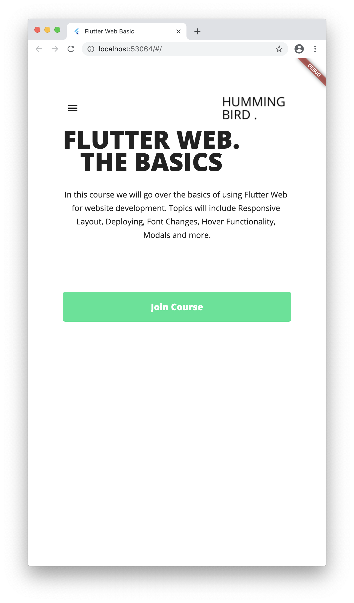
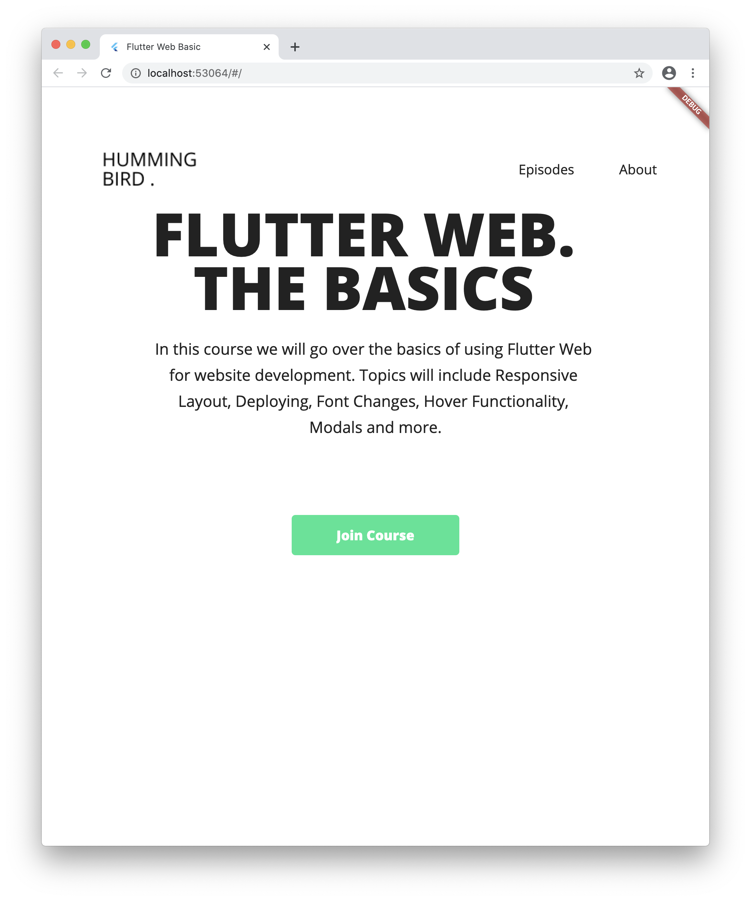
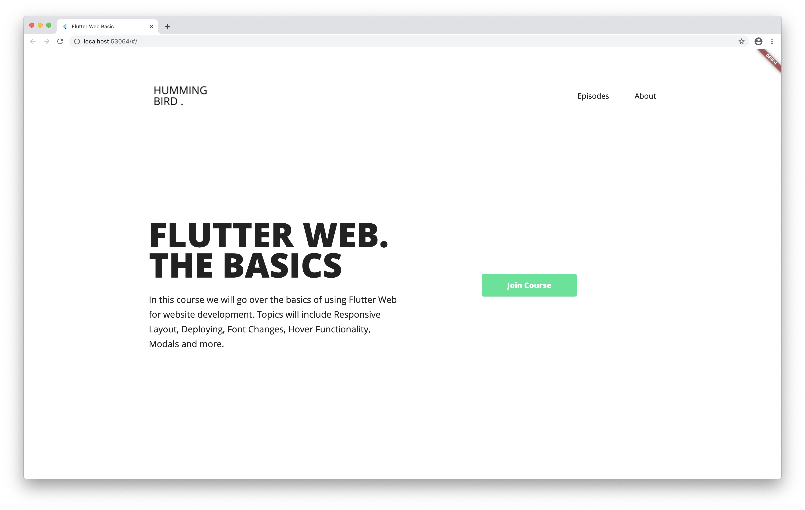

# flutter_web_basic

Flutter Web Practice to Build Simple Introduction Page

## How to Setup

1. flutter channel master
2. flutter upgrade
3. flutter doctor
4. flutter config --enable-web
5. flutter devices
6. flutter create flutter_web_basic

## How to Build Web

flutter build web

## Features

1. This is using GetIt instance to maintain Navigating services as a singleton pattern.

2. Navigating does not change all of the views. Layout still remains when it is navigated. LayoutTemplate widget has been used.

3. By responsive_builder, this web site is supporting mobile, tablet, desktop platform.

4. App Drawer has been used for Navigating Tab on the mobile platform.

## Demo

    
    
    

