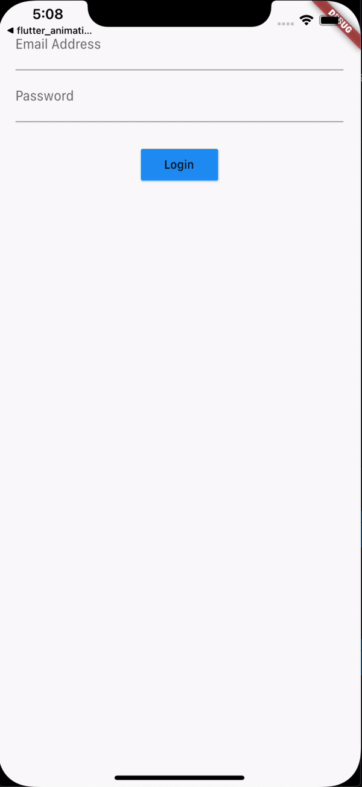

<h1 align="center">flutter_bloc_pattern</h1>

    The project to practice state management by BLoC Pattern with implementing Login Page which takes Email and Password inputs.

## Features

1. The BLoC Pattern has been used with Inherited Widget, not as a Package.

2. By implementing Inherited Widget, RxDart has been used.

3. While handling Stream, transformation has been used for implementing validation.

## Demo

    

