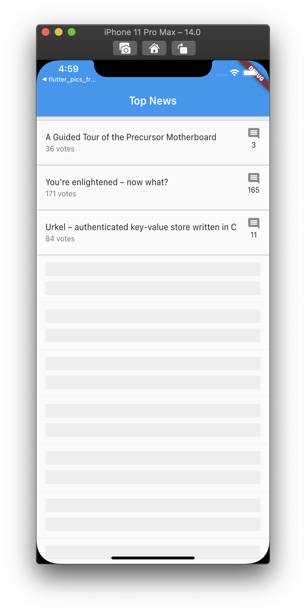

<h1 align="center">flutter_database</h1>

    The Project to Test Interacting with Database by Implementing API & DB Provider

## Features

1. This project has very importatn skills which is handling the api and db by repository class.

2. Database in here means Internal Storage for the caching, not the disk database like MySQL, MongoDB.

3. API Provider and DB Provider has common feature, and that was implemented as a abstract class.

4. Before fetching data from the other server by using API Provider, the machine cheks the internal storage by the DB Provider that has cached.

5. Do not use API & DB Provider direcly, they are handled by the Repository Class.

6. The major data which has state is Stories and Comments. They are managed by the BLoC Pattern with Inherited Widget.

7. The stories on this project support Infinity Scroll with Shimmer UI when it is loading.

8. State Managed data that is using BLoC is using RxDart and StreamBuilder Widget. (Stream Data is transformed in the BLoC Class internally to provide only needed data.)

9. Comments of the Comment are fetched by the recursive way.

10. There is a Unit Test on the test Directory.

## Demo

    
    
    

