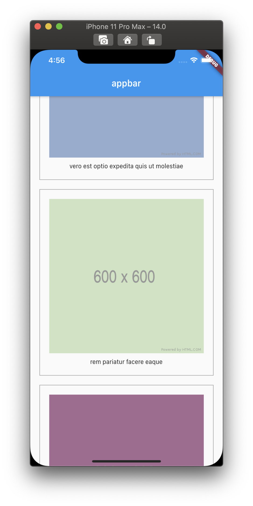

<h1 align="center">flutter_pics_from_http</h1>

    The Project to Practice Http Communication and Image Handling

## Features

1. Image that has been fetched is handled by the ImageModel Class.

2. Images are fetched on the initState of the Main Page of the App.

3. Fetched images that have been process into the ImageModel Class are showed by the ListView.

## Demo

    

