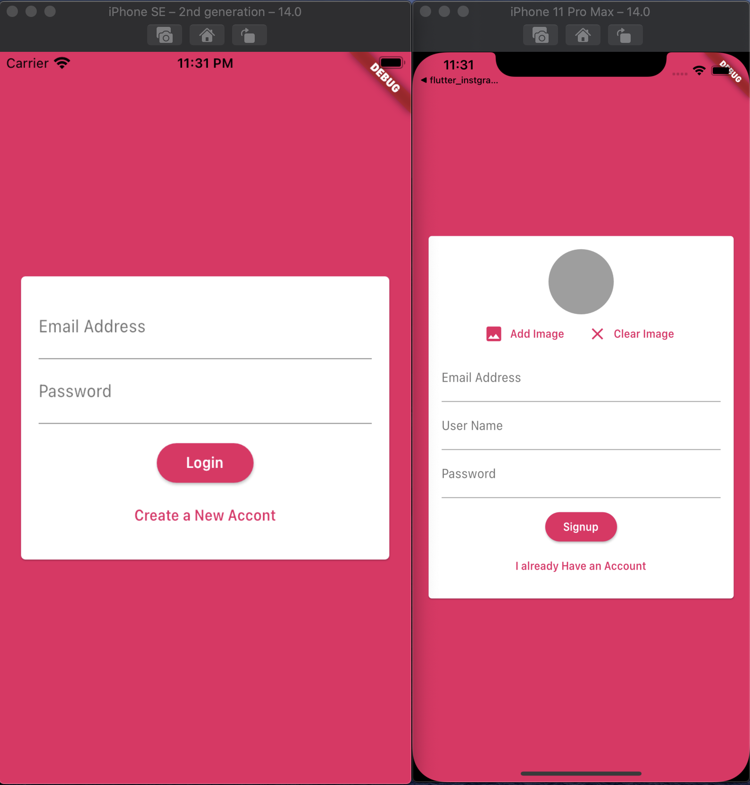

<h1 align="center">flutter_chatting_application</h1>

    The project to implement chatting application by Http Communication on the Firebase

## Features

1. Along with the flutter_database project by the Stephen Grider, this project is also important. This application is using FCM service to notify other user that someone sent a message.

2. FCM service is provided by setting FCF on the Firebase.

3. User Creattion and Management is handled on the Firebase Authentication with logging the user information on the database. This authentication is provided by the stream data and StreamBuilder use it.

4. The chatting information is saved on the Cloud Firestore of the Firebase. When chat occurs, the chat is recorded on the Firebase and all of the chat data is provided by the stream. So the user can get the data, though the counterpart didn't notify it. (Originally when the event occurs, the client should be noticed the event. So the most of this situation, Web Socket like socket.io is preferred not to listen all the time whether event is occured. In this case, however, StreamBuilder Widget keeps listening the change of the data, and automatically fetch it when the data changes.)

5. Unlike the fetching chat when the counter part sent it, the notification on the foreground or background should be implemented by occuring the event. (Because we cannot notify the chat by stream data of the Cloud Firestore well.) So the Node.js Code for the Firebase Cloud Function has been used for notifying the chat.

## Demo

    
    
    

