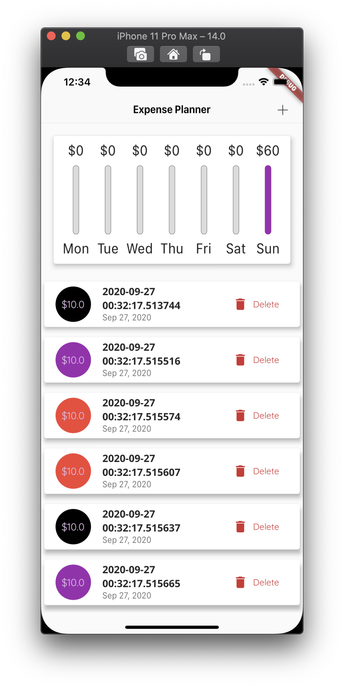
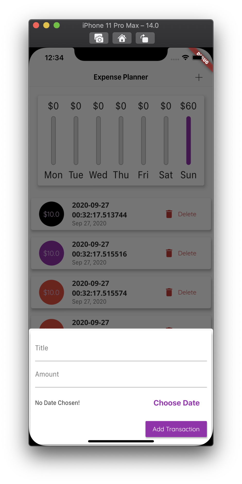
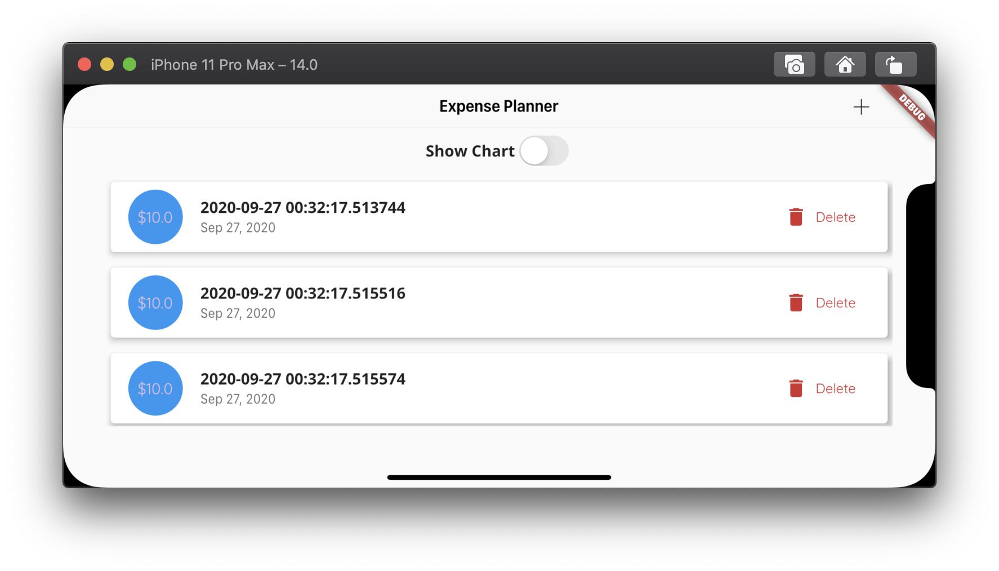
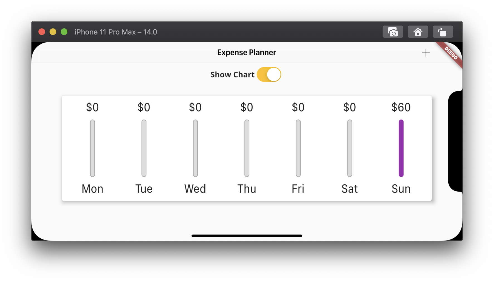

<h1 align="center">flutter_expense_planner</h1>

    The Projecto to Improve Responsive Skill on Each Platform of Mobile

## Features

1. This project supports the platform distinctive UI.

2. This project supports the LandScape Mode UI.

3. LayoutBuilder and the Sizeo of MediaQueryData has been used.

## Demo

    
    
    
    

