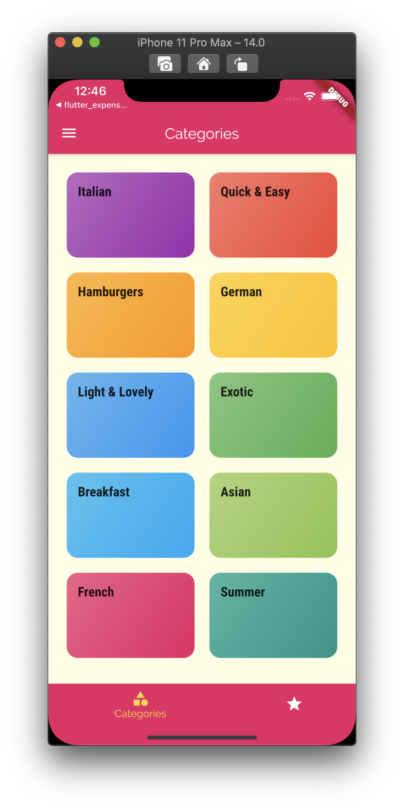
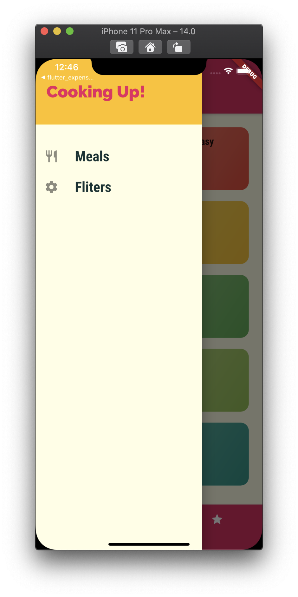
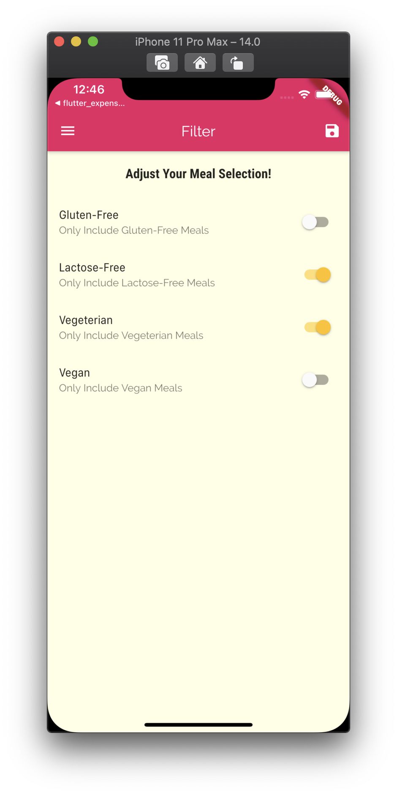
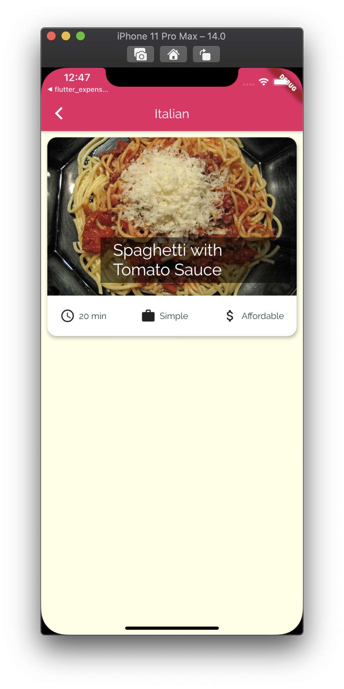
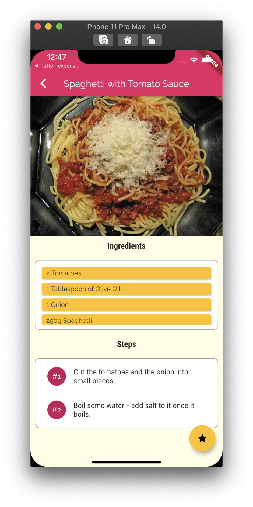
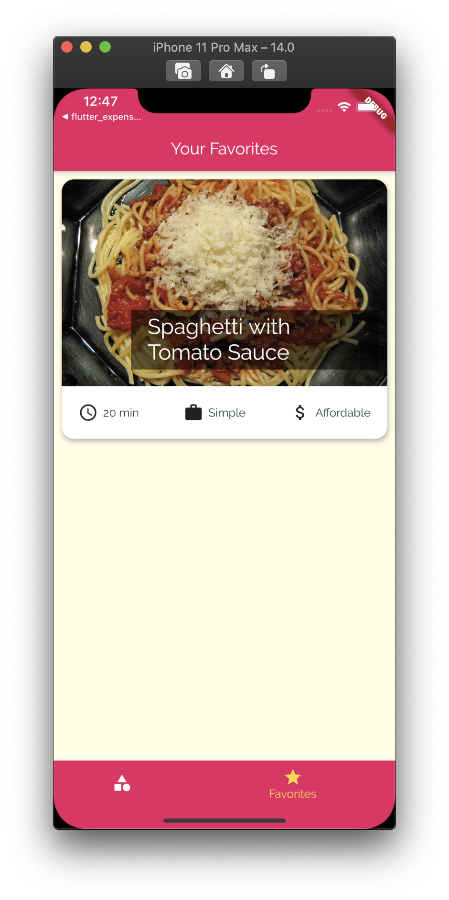

<h1 align="center">flutter_meals_app</h1>

    The Project to Improve Skill on Navigating the Screen and Handling Data by Given Dummies

## Features

1. There are 2 data classes, Category & Meal.

2. The purpose of this project is not testing Http Communication, so handling data is given dummies when the application initially built.

3. The navigating of this app is not using generating method, but using named navigating with static const route name of each page.

4. There are also some tabs to navigate, and each tab could has drawer things. These data are maintained by the Map data structure.

5. Filtering is available about given dummies. They are managed in the Lists which is defined on the initial page of the dummies. (Thus, the state is rollbacked when the application built on the initial state.)

## Demo

    
    
    
    
    
    

