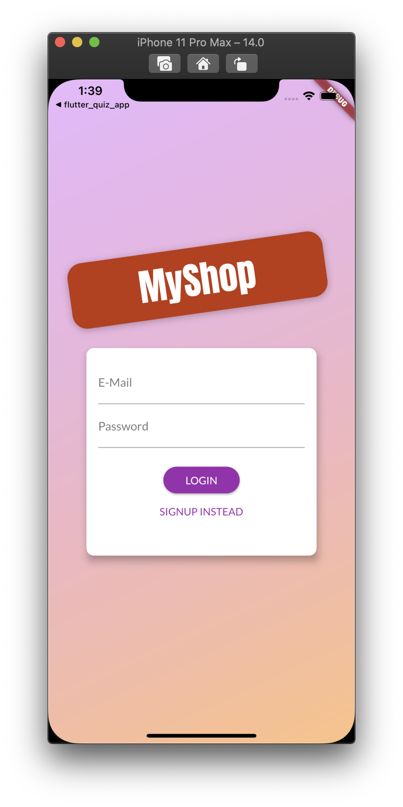
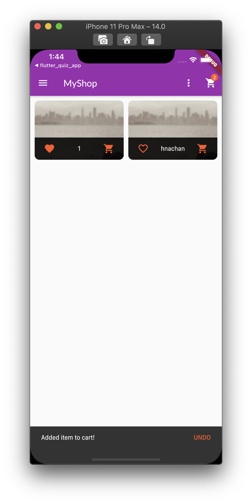
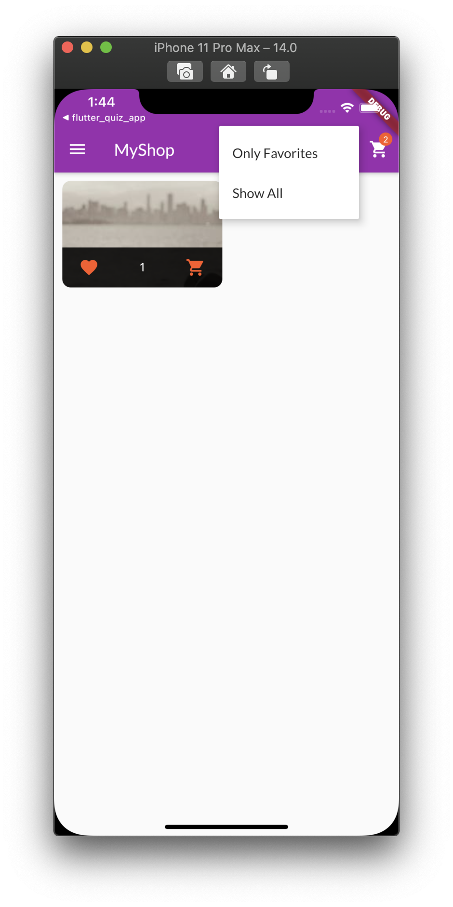
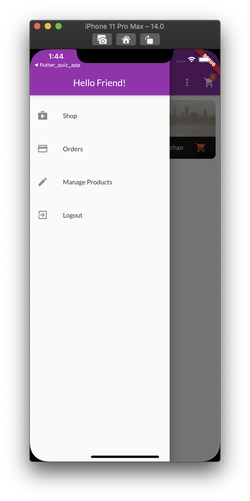
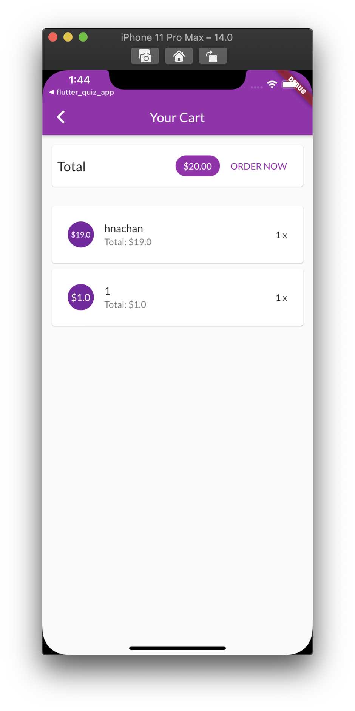
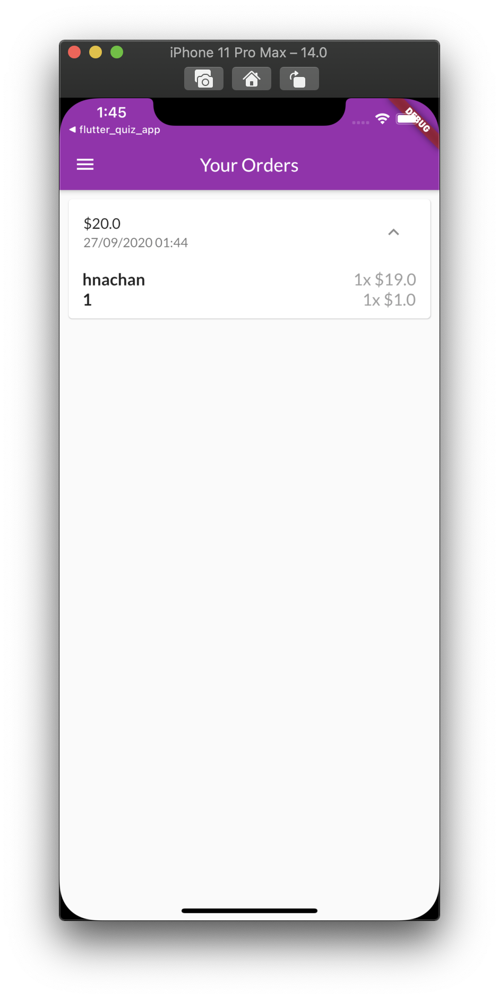
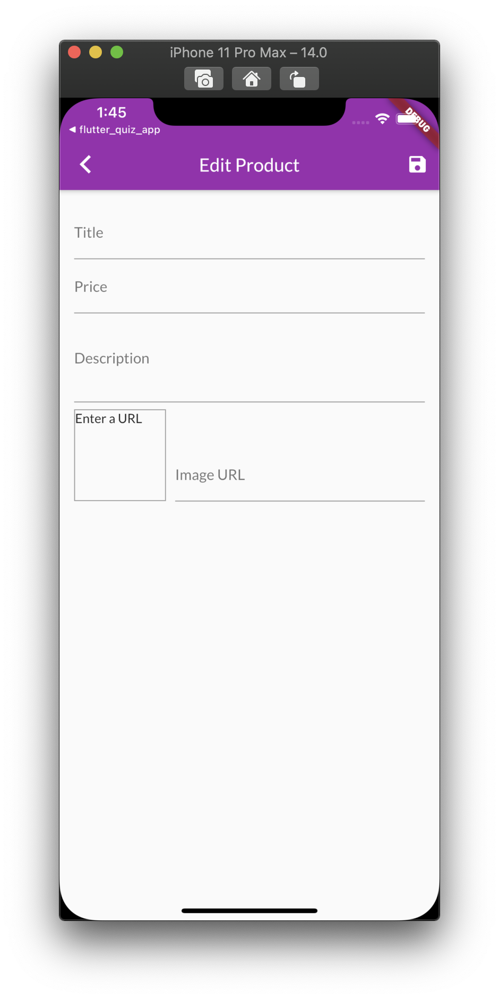

<h1 align="center">flutter_replaced_shop_app</h1>

    The project to improve skills on nested state management by Provider

## Features

1. Navigating animation implemented and applied to the MaterialApp Widget.

2. MultiProvider has been used for Authentication, Cart, Order, Product. Related Providers are applied as a ChangeNotifierProxyProvider Widget.

3. Authentication Provider is using Firebase to get the Token for auto login. When the user get the Token from Firebase, the Token saved on the local storage by shared preferences.

4. If user does not have a Token, the user automatically logged out.

5. Custom Http Exception has been created to catch the Http Error precisely.

6. The user automatically logged out when the Token expires.

7. The data like Cart, Order, Product are using Firebase, but not Cloud Firestore.

8. Filtering by favorites are applied.

9. User interaction like snack bar, undo, fetching state ui for loading are implemented.

## Demo

    
    
    
    
    
    
    

