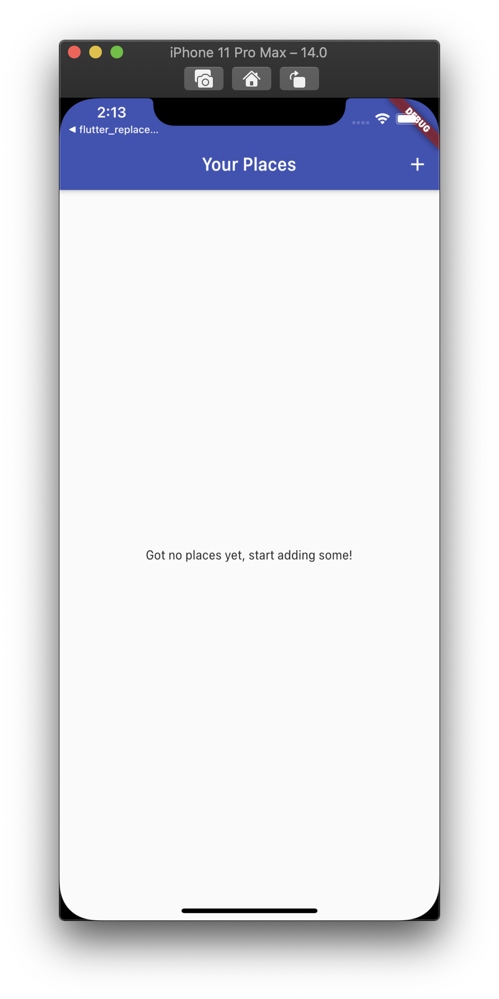
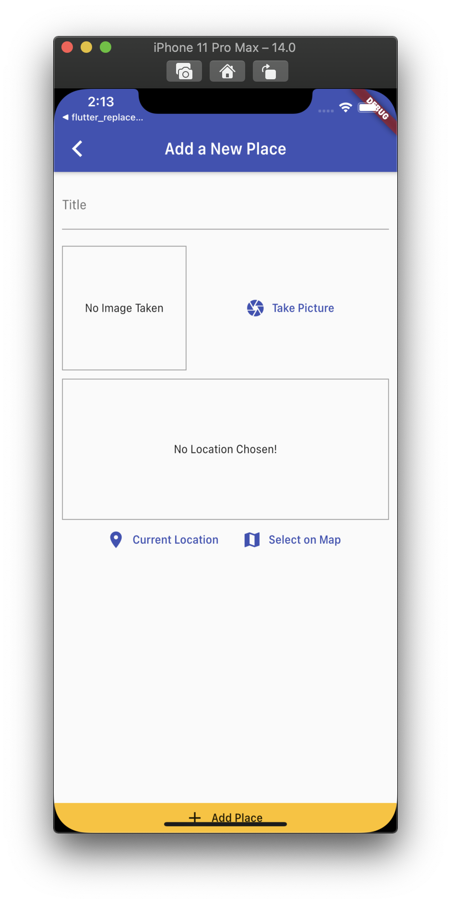

<h1 align="center">flutter_using_native_app</h1>

    The project to learn how to use native feature by flutter with Provider state management

## Features

1. To get the image from camera, Image Picker has been used.

2. To get the location by Google Map, this project use the API KEY which was get from the Google Services. The functions which are related to the API are implemented into the LocationHelper Class.

3. To reduce the number of Http Request to the API Server of Goolge, the used data are cached into the internal storage by using sqlflite. This is managed by the DBHelper Class.

4. The registered places are managed into the state by Provider.

5. Detail page of the registered place is implemented. When the user want to see the location more precisely and expanded, the screen navigates to the expanded Google Map which is showing the marked location.

6. To use the native features like camera, photo library, gps, the permissions on the proper platform should be set.

## Demo

    
    

-   Cannot test the camera module on the iOS simulator. If the application does not use library to get the photo, only camera is accepted so Android platform would be need to register the place.

-   Goolge Map Package is deprecated, so the Demo is not reflecting all of the implementation well.
