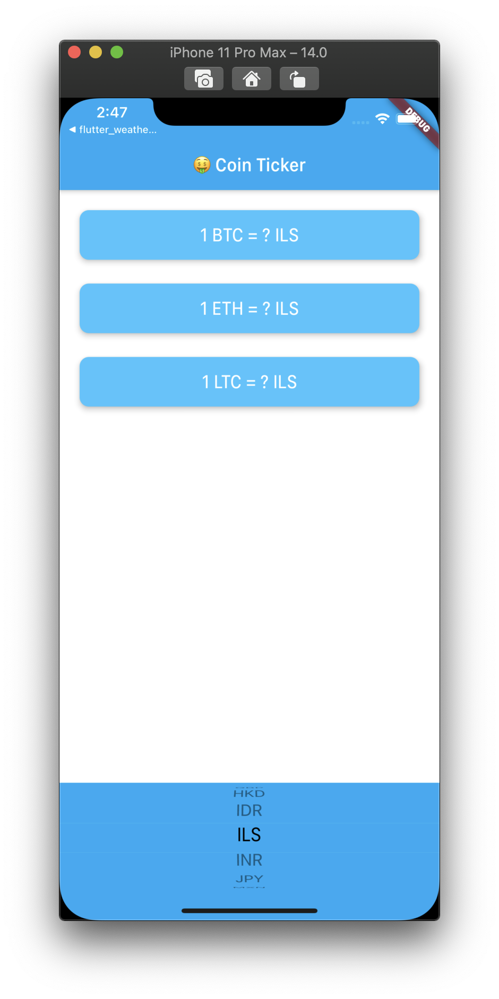

<h1 align="center">flutter_bitconin_ticker</h1>

    The Project to Learn the Various Widgets in the Flutter

## Features

1. This application shows the BTC value to the currency of each country.

2. To get the information of the BTC to the each country, this application makes the Http Request. This process is handled by the CoinData Class.

3. Picking the country is adaptive UI which is fitted to the proper platform.

## Demo

    

-   Currently, the responding API Server is broken down. Thus, this application is not working well.
