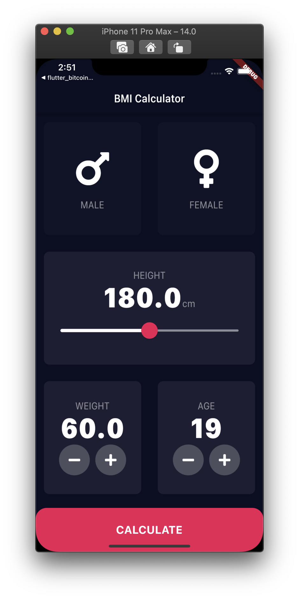

<h1 align="center">flutter_bmi_calc</h1>

    The project to learn about UI and controlling the value into the UI

## Features

1. Navigating is handled by the static const route name of the screen.

2. Gener information is managed by the enumeration.

3. The long press of the button changes the showing state in real-time. The status of the long press is separated to the start and end.

4. To set the value of the height, Slider and SliderTheme Widgets have been used.

## Demo

    
    

