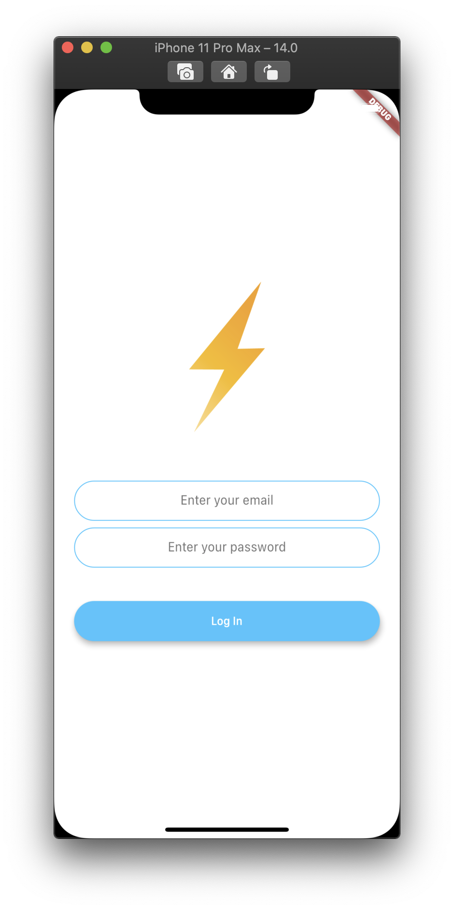
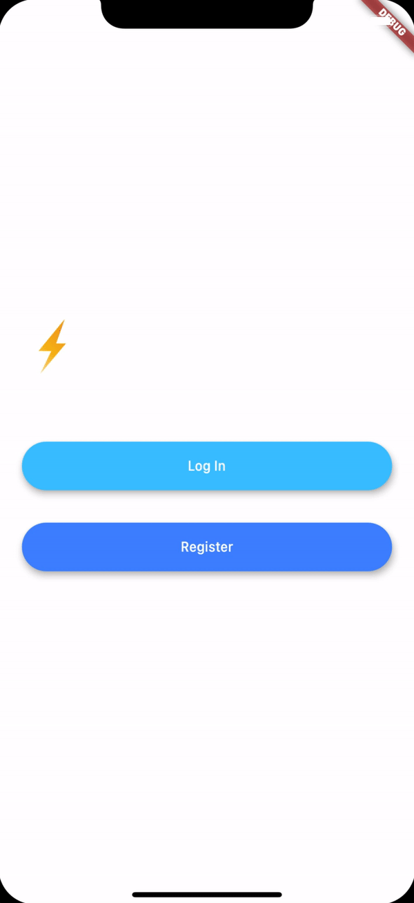

<h1 align="center">flutter_flash_chat</h1>

    The project to implement chatting application by using Firebase simply

## Features

1. Chat contents are saved on the Cloud Firestore of Firebase.

2. Authentication is processed by Firebase Authentication.

3. Animation and AnimationController to show the UI dynamically have been used for the screen before chatting.

4. Messages that have been chatted are fetched by the stream data from Cloud Firestore, and StreamBuilder Widget use them. They are intialized as a MessageBubble Widget and showed on the ListView.

5. The application logo on the initial page, animated_text_kit package has been used.

## Demo

    
    
    
    

