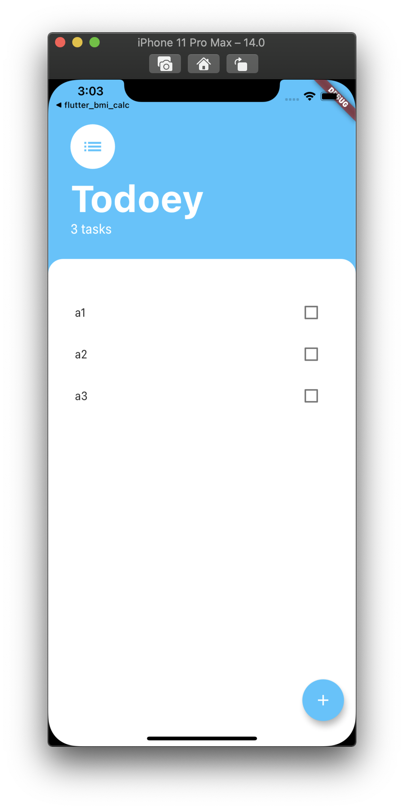
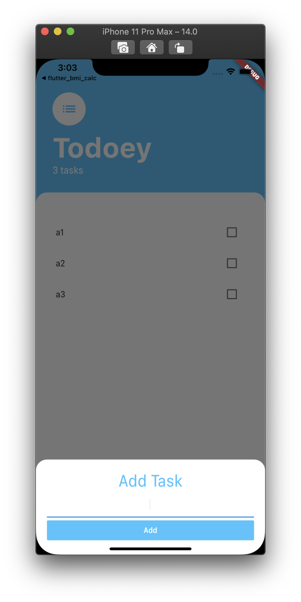

<h1 align="center">flutter_todoey</h1>

    The Project to Practice State Management with Provider Simply

## Features

1. The todo task is implemented as a Task Class.

2. The data of the tasks are managed by the TaskData Class which is using ChangeNotifier Mixin. The value of the class is maintained on the root of the application with a named constructor "value" of the ChangeNotifierProvider Widget.

3. When the user add a task, the notifier notify to the Widget Tree that there's a change compared to the previous state. (Also on the deleting a task.)

4. Each task is using the functions which is passed by a callback function.

5. Todo tasks are maintained as a volatile data.

## Demo

    
    

