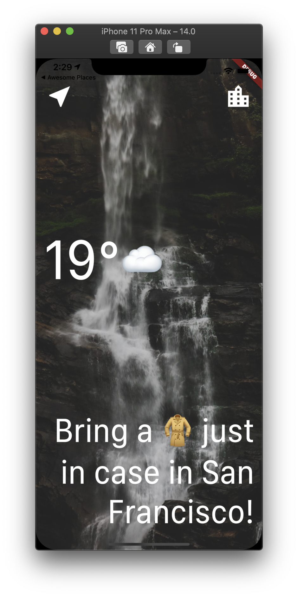
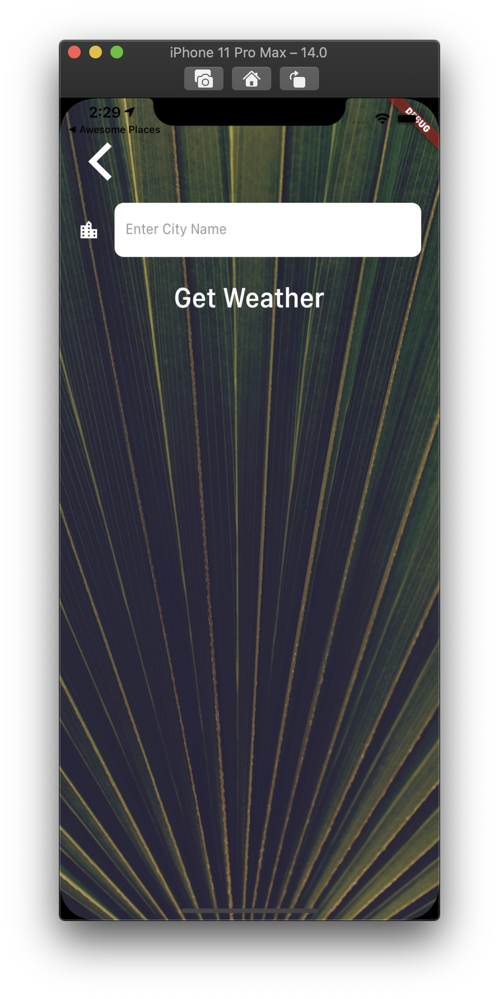

<h1 align="center">flutter_weather_app</h1>

    The Project to Learn about the Concept ot the Services and Navigating with Http Communication

## Features

1. Http Requests are handled by the NetworkHelper Class.

2. Location is implemented as a class.

3. When the location is set by the Location Class, user can get the data of weather from the API by WeatherModel which has a lot of inner methods.

4. Searching by the city name is enabled. When the user search the city name, the screen is navgiator popped and the value returned to the previous screen.

5. The initial screen is loading screen. When the data fetched successfully which was called in the initState of the Widget, the screen navigates to the location screen.

## Demo

    
    

