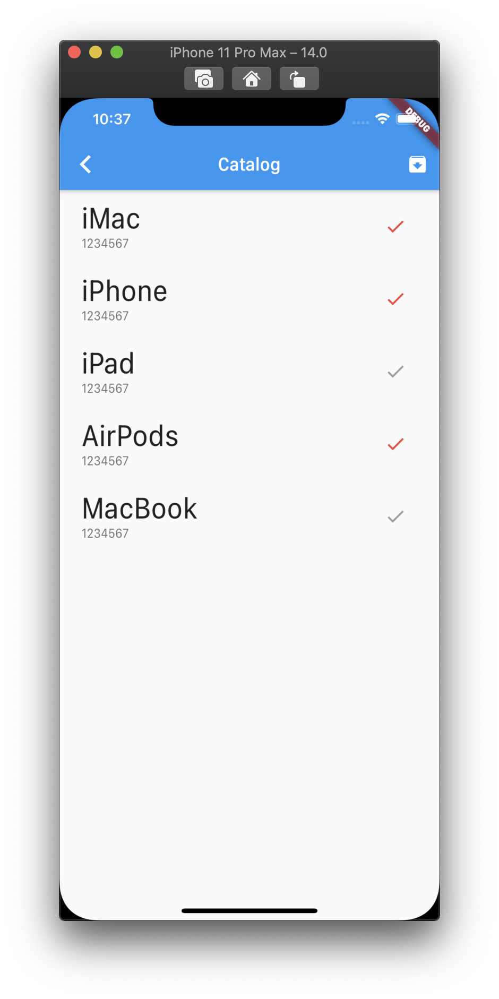

<h1 align="center">flutter_cart_application</h1>

    The Project to Simply Test BLoC Pattern by Package and Inherited Widget

## Features

1. Login, Catalog, Cart screens are simply implemented without complicated functions

2. The screens of the project which is using Cart model is implemented by BLoC Pattern of Inherited Widget

## Demo

    
    
    

