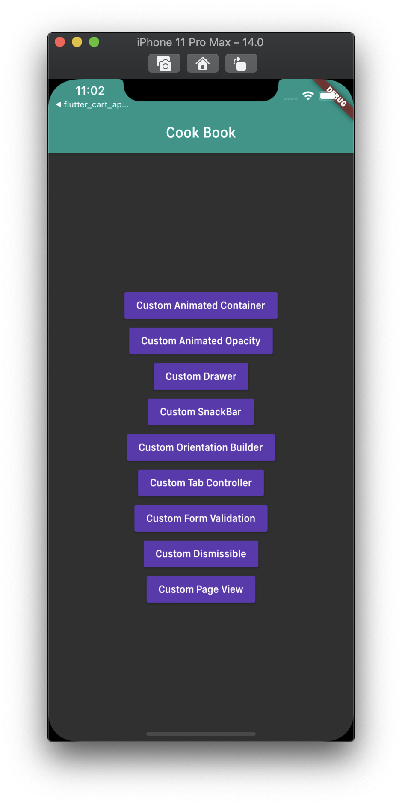
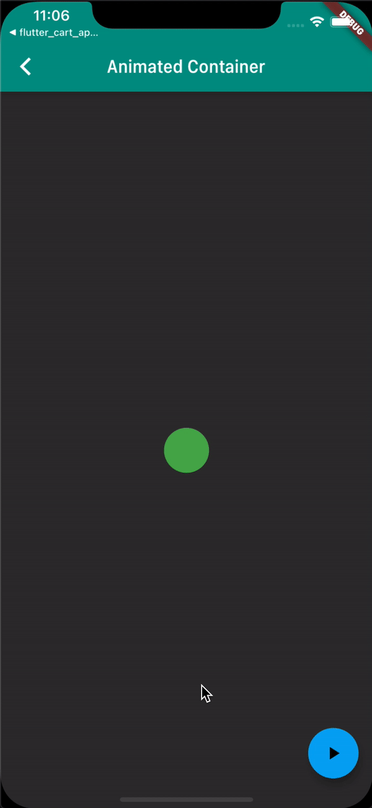
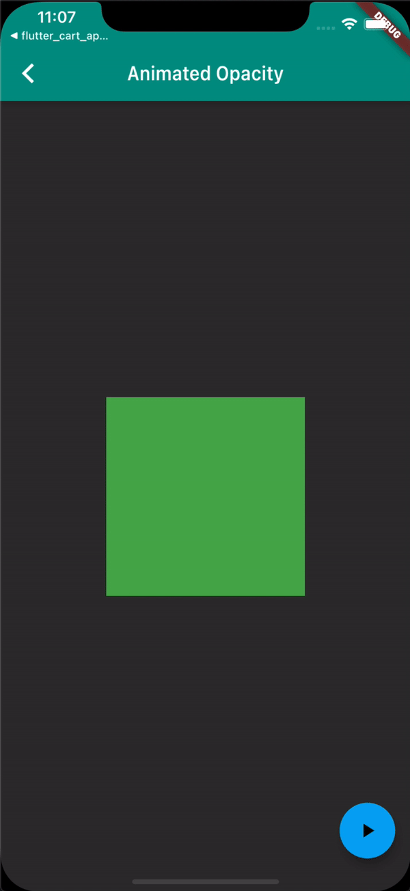
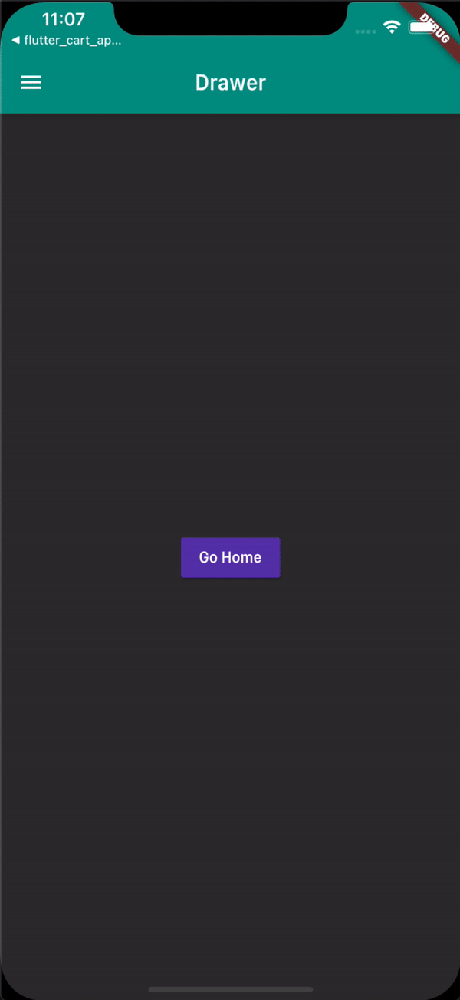
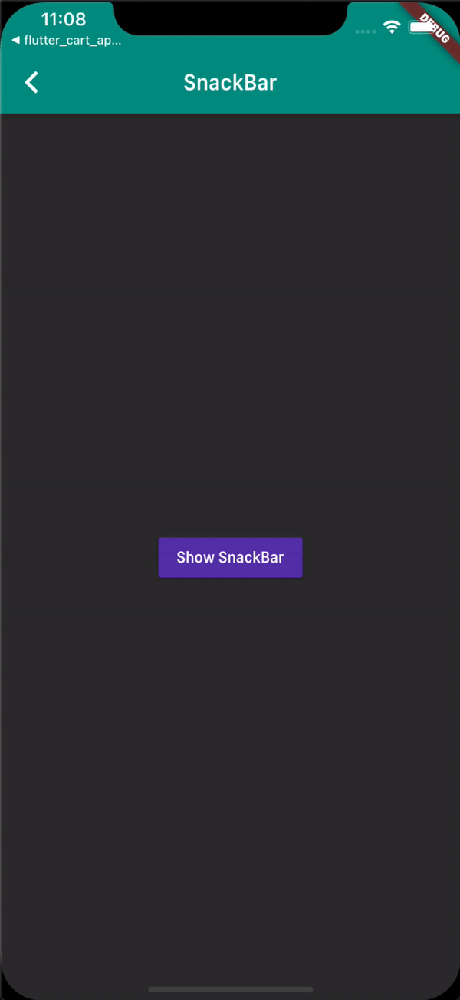
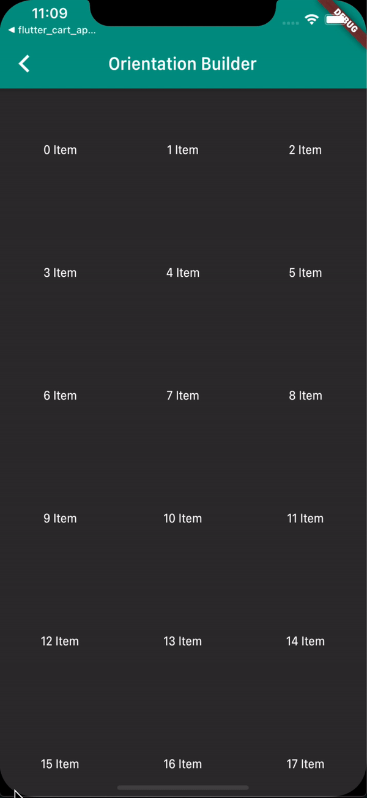
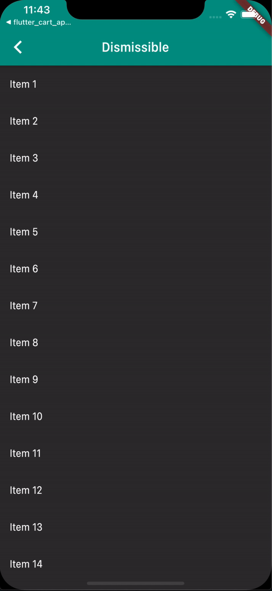

<h1 align="center">flutter_cook_book</h1>

    The project to test the overall of Flutter

## Features

1. Animation & AnimationController

2. Opacity with Animation

3. Custom Drawer on the AppBar

4. Custom SnackBar

5. Custom OrientationBuilder with GridView

6. TabController on the AppBar

7. Form Validation

8. Dimissible on the listed item

9. PageView

## Demo

    
    
    
    
    
    
    
    
    
    

