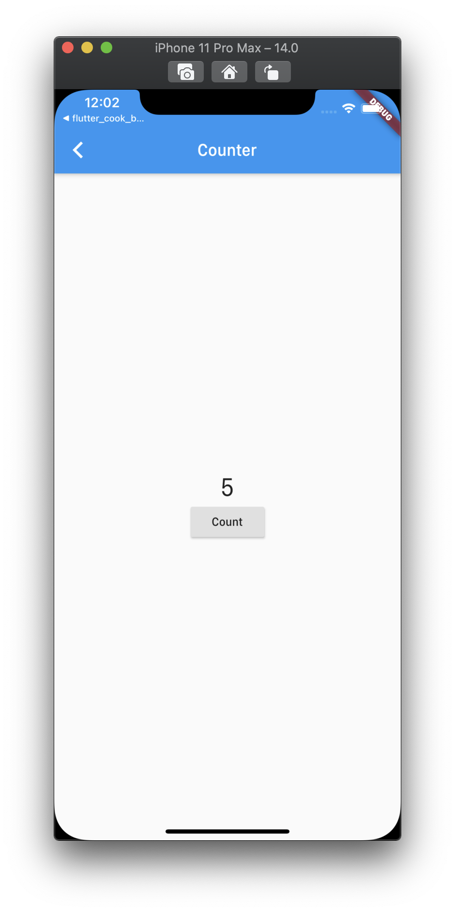
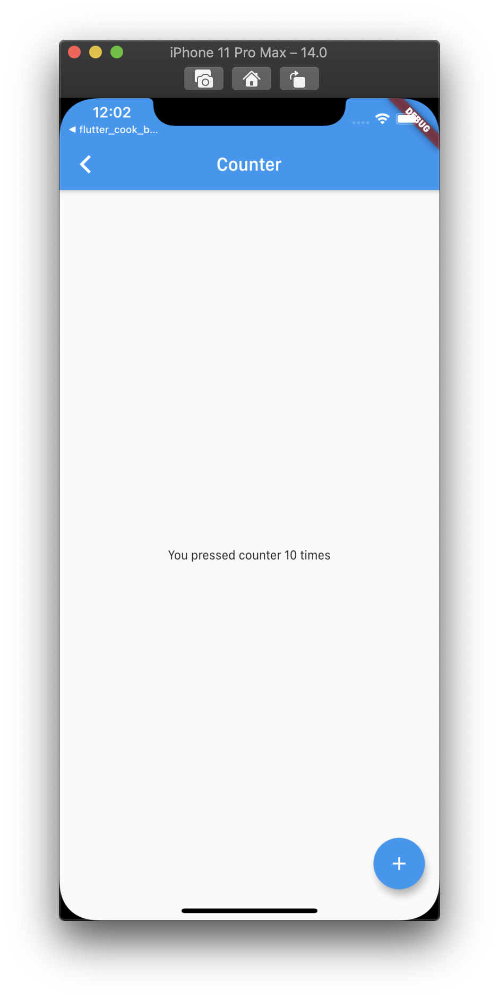

<h1 align="center">flutter_counter_using_bloc</h1>

    The Counter Application by BLoC Pattern with RxDart

## Features

1. Example 1 is using Counter with StreamBuilder which is directly providing BehaviorSubject in RxDart.

2. Example 2 is using Counter with StreamBuilder which is providing BehaviorSubject in RxDart from CounterBloc.

## Demo

    
    

