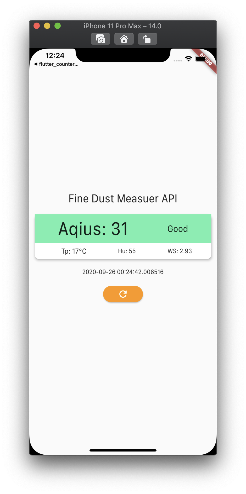

<h1 align="center">flutter_fine_dust_application</h1>

    The Project to Improve Skill of Http Communication and Stream of RxDart

## Features

1. The class which has been used on BLoC Pattern with Stream of RxDart is automatically generated by web site.

2. Fetching data from the API Server is converted to the stream data. UI keeps changing when the data changes by fetching from the API Server.

3. By testing code, Flutter Unit Test is possible to test whether fetching the data from the API server is working well.

## Demo

    

