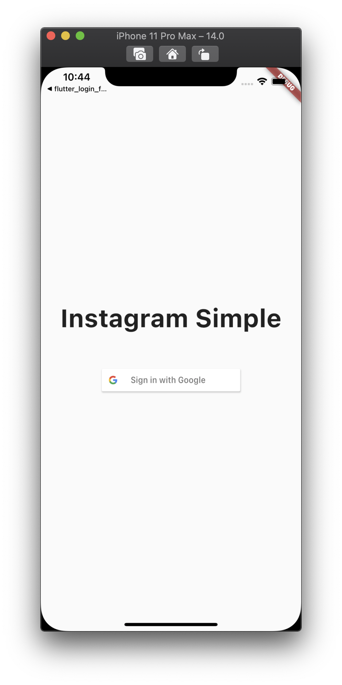
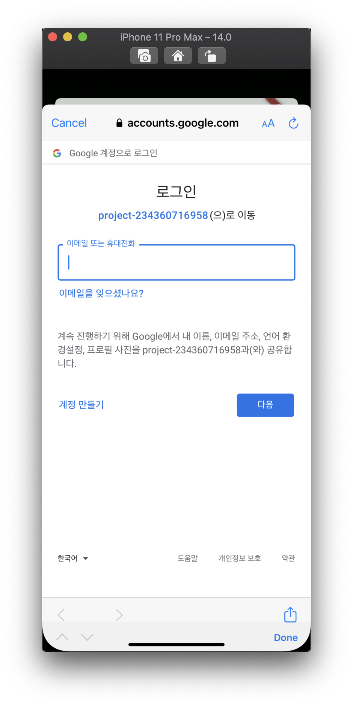
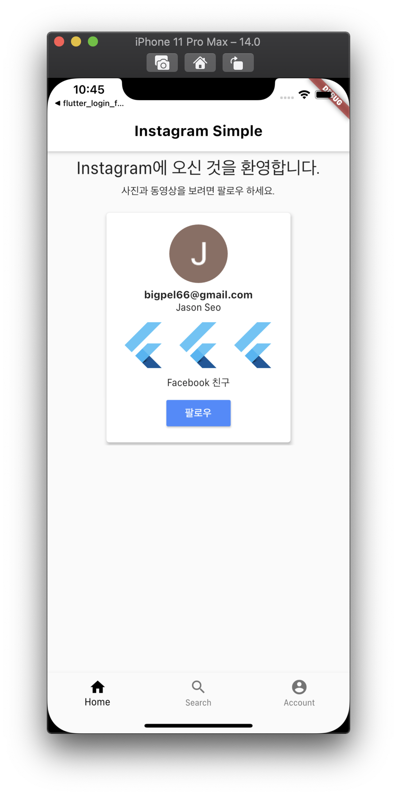
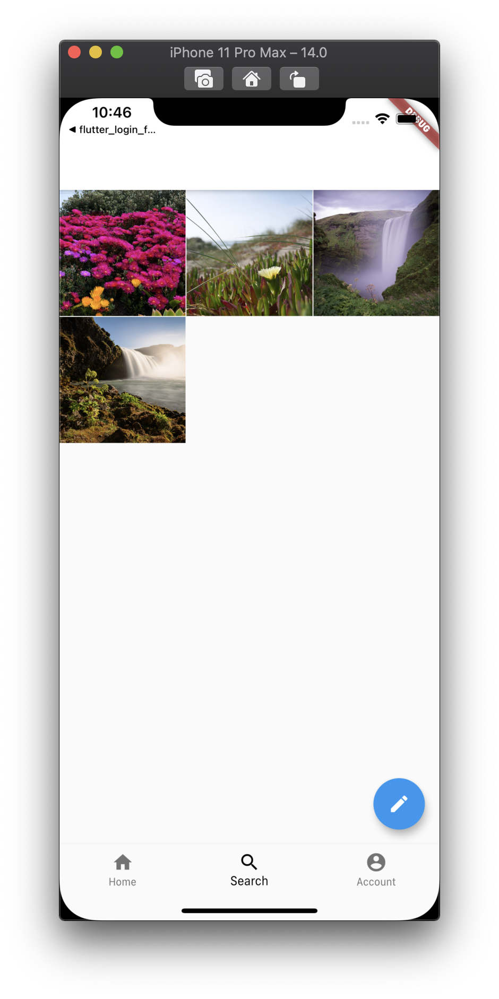
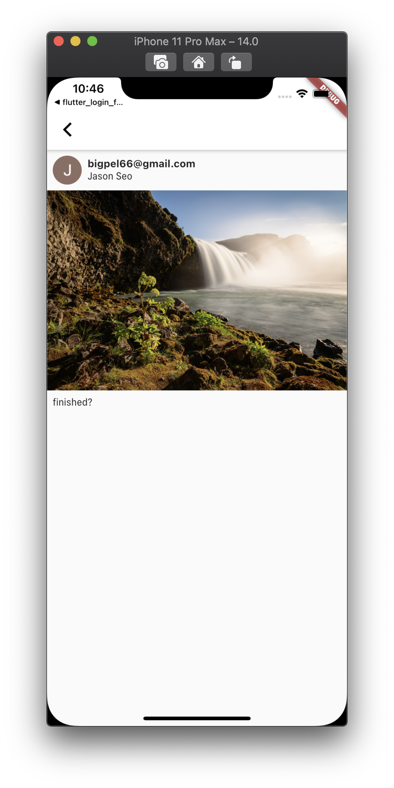
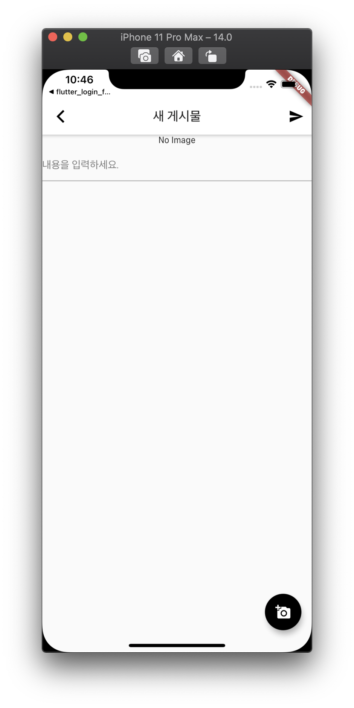

<h1 align="center">flutter_instagram_simple</h1>

    The Project to Practice Generating UI, Linking Backend Service by Firebase

## Features

1. This is the simple version of Instagram clone.

2. Google Sign In can be processed by Firebase.

3. UI that is similar to the Instagram, and only Login and Posting can be used.

## Demo

    
    
    
    
    
    
    

