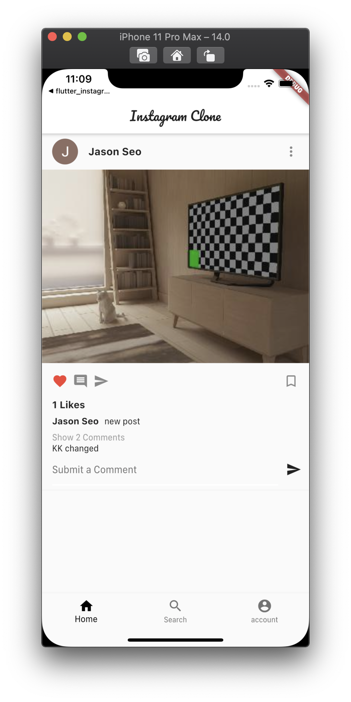
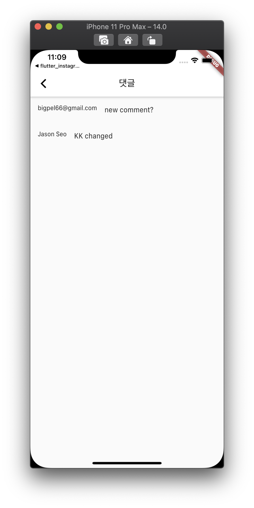
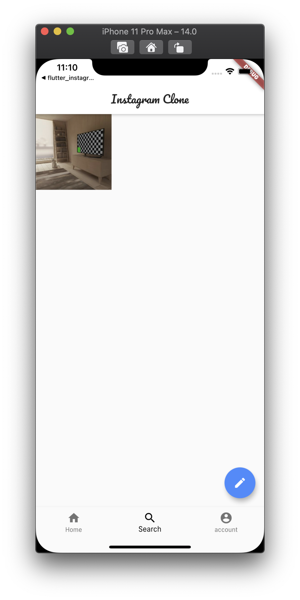
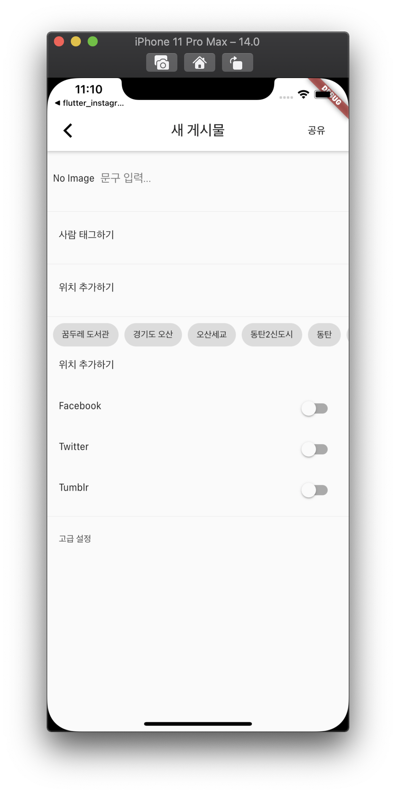
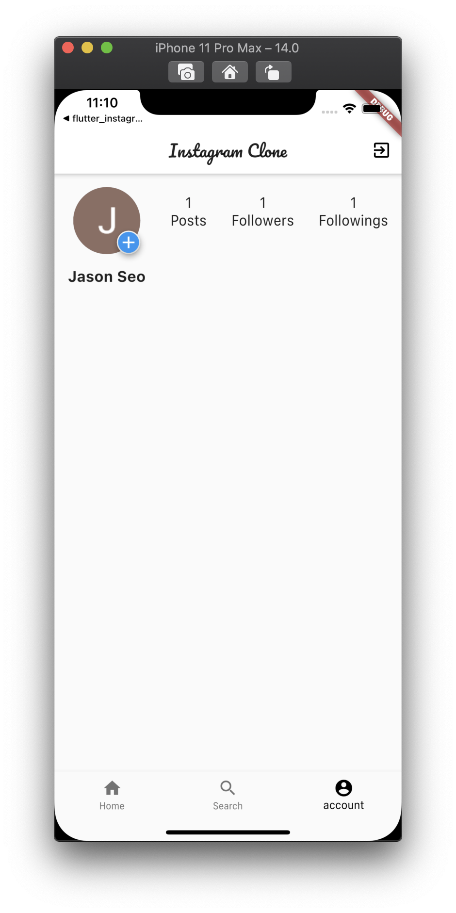

<h1 align="center">flutter_instagram_complex</h1>

    The project to practice generating ui, linking backend service by firebase more deeply than simple version

## Features

1. This is the complex version of Instagram clone.

2. Google Sign In can be processed by Firebase.

3. UI that is similar to the Instagram, and Login, Feed, Comment can be used.

## Demo

    
    
    
    
    
    
    

