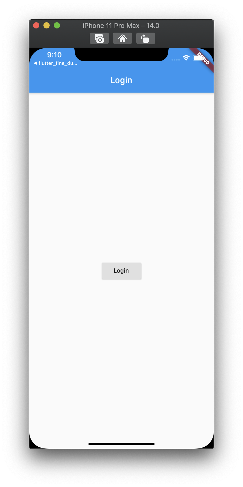
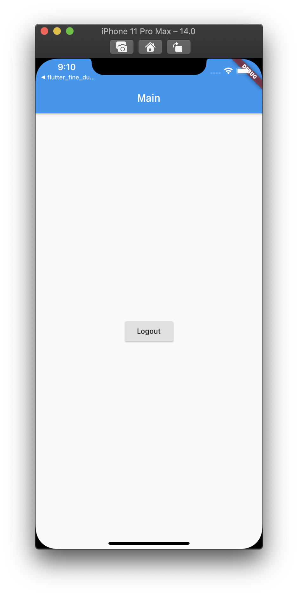

<h1 align="center">flutter_state_management_practice</h1>

    The project to practice state management by Provider and BLoC Pattern

## Features

1. Nothing speical on the project, just testing login or logout by changing state.

2. State Management by Provider is using ChangNotifierProvider with ChangeNotifier Class.

3. BLoC Pattern is using provider which was implemented by Inherited Widget. (Not using RxDart)

## Demo

    
    

